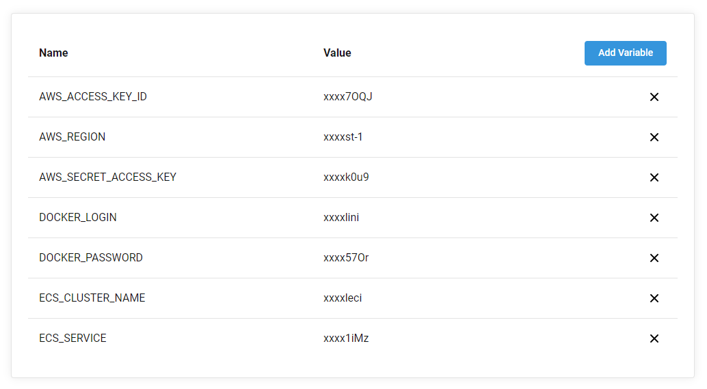

# Node app on Docker with CircleCI configuration

This project has a configuration for CircleCI to update the Node App deployed on a AWS infrastructure. The Node App will be updated in a docker image before

## Docker congifuration

To make this project work, you need to build this project with docker and add it in docker hub.
To build the image just run the following command:

    docker build -t <name> .
    
Then you can run it using this command (this project is being exported to port 80, but you can change the port in your local machine):

    docker run -d -p 80:80 <name>
    
If everything works, you can configure your docker hub in your terminal and then run the following commands to add it in docker hub:

    docker tag <name>:latest <docker_hub_username>/<docker_hub_name>:<tag>
    docker push <docker_hub_username>/<docker_hub_name>:<tag>

## AWS Infrastructure

After having the image in your docker hub user, you can use [this AWS stack](https://github.com/TramboCloud/CF-ECS) to deploy your docker image with [AWS CloudFormation](http://docs.aws.amazon.com/AWSCloudFormation/latest/UserGuide/Welcome.html).

## CircleCI configuration

Once deployed, you can setup CircleCI with your linked git repository. So you can go to the Project Settings and in Environment Variables setup the following variables:

After this, every time you push a change to your master branch it will run a new pipeline in CircleCI and if you want to add more steps or change the configuration, you can go to the `.circleci/config.yml` file and update it for your needs.
